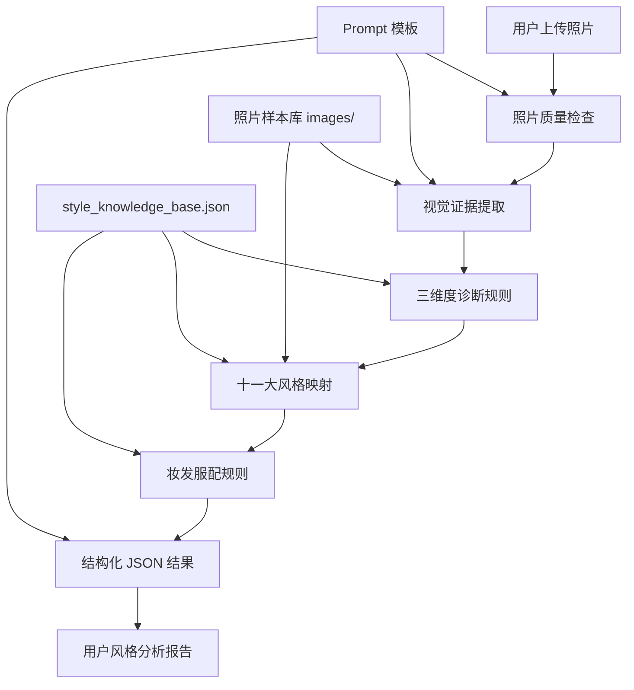

# 知识库框架

这份文档是“上传照片后自动做人物风格分析”的知识库总框架。它回答三个问题：

1. 知识库里应该放什么。
2. 每类资料怎么命名、怎么关联。
3. AI 分析照片时应该如何调用这些资料。

---

## 一、总体结构 

知识库分成 6 层：

```text
L0 原始资料层
  课程逐字稿、课程截图、原始案例、客户反馈

L1 精读知识层
  从课程中提炼出的理论、规则、判断逻辑

L2 结构化规则层
  机器可读的风格、维度、映射、妆发服配规则

L3 视觉样本层
  十一大风格照片、三维度对比图、妆发服配正反例

L4 Prompt 与调用层
  系统 Prompt、用户 Prompt、输出 JSON Schema、补问逻辑

L5 结果与迭代层
  用户分析结果、人工修正、误判案例、后续优化记录
```

对应到现在项目里已有文件：

| 层级 | 作用 | 当前文件 |
|---|---|---|
| L0 原始资料层 | 保留课程原文，方便回溯 | `人物风格课程视频逐字稿.md` |
| L1 精读知识层 | 给人看的核心理论 | `人物风格精读笔记.md` |
| L2 结构化规则层 | 给程序读取的知识库 | `style_knowledge_base.json` |
| L3 视觉样本层 | 指导你从视频截哪些图 | `照片素材截图清单.md` |
| L4 Prompt 与调用层 | 给 AI 模型的稳定提示词 | `AI风格分析Prompt与结构化知识库.md` |
| L5 结果与迭代层 | 暂未建立，后续上线后补 | 建议新增 `analysis_cases/` |

---

## 二、推荐目录结构

后续可以逐步整理成下面这样：

```text
风格色彩课程/
  README.md
  知识库框架.md

  sources/
    人物风格课程视频逐字稿.md
    course_timecodes.md

  knowledge/
    人物风格精读笔记.md
    十一大人物风格.md
    三维度诊断规则.md
    妆发服配规则.md

  structured/
    style_knowledge_base.json
    image_manifest.json
    output_schema.json

  prompts/
    system_prompt.md
    user_prompt_template.md
    report_prompt.md

  images/
    01_styles/
    02_dimensions/
    03_makeup_hair_clothing/
    04_accessories/
    05_intro_optional/

  analysis_cases/
    user_cases_private/
    corrected_cases/
    misjudged_cases/
```

现在不用立刻搬文件，先按这个框架继续补内容就行。

---

## 三、核心知识模块

### 3.1 十一大风格模块

每个风格都应该固定包含这些字段：

```text
风格名称
坐标：曲直 / 量感 / 动静
核心感觉
视觉特征
气质特征
适合妆容
适合发型
适合服装
适合配饰
不适合方向
容易混淆的相邻风格
参考人物
参考图片
```

十一大风格包括：

```text
少女型
少年型
罗曼型
浪漫型
古典型
时尚前卫型
优雅型
戏剧型
都市睿智型
自然型
异域自然型
```

这部分已经主要写在：

- `AI风格分析Prompt与结构化知识库.md`
- `style_knowledge_base.json`

### 3.2 三维度诊断模块

AI 分析任何照片，都必须先经过这三个维度：

```text
曲直：偏曲 / 曲直兼有 / 偏直
量感：小量感 / 中量感 / 大量感
动静：偏静 / 动静兼有 / 偏动
```

这三个维度是风格分析的“中间层”，不能跳过。

正确流程：

```text
照片证据 -> 三维度判断 -> 风格候选 -> 最终主风格 -> 妆发服配建议
```

错误流程：

```text
照片 -> 直接说你是某某风格
```

### 3.3 妆发服配模块

这部分用于生成结果页建议。

建议拆成 4 个子模块：

```text
makeup_rules：妆容规则
hair_rules：发型规则
clothing_rules：服装规则
accessory_rules：配饰规则
```

每条建议都要能回到三维度：

```text
为什么适合这个妆？
因为用户偏小量感，所以妆容应色块多、线条少。

为什么不适合这个发型？
因为用户偏直线型，过强曲线抽丝发型会和人物底层线条冲突。
```

### 3.4 视觉样本模块

照片素材不是为了“让 AI 记住明星”，而是为了提供可对照的视觉证据。

每张图最好都带标签：

```json
{
  "id": "style_girl_zhaolusi_001",
  "file": "images/01_styles/少女型_赵露思_圆脸甜美小量感.png",
  "source_video": "第1课",
  "timecode": "15:08",
  "people": ["赵露思"],
  "style_tags": ["少女型"],
  "dimension_tags": {
    "curve_straight": "偏曲",
    "volume": "小量感",
    "dynamic_static": "偏动"
  },
  "usage": ["风格正例", "小量感曲线参考"],
  "notes": "用于说明圆润、幼态、甜美、小量感。"
}
```

后续可以把这些信息做成 `structured/image_manifest.json`。

---

## 四、AI 调用流程

上传照片后的推荐流程：

```text
1. 用户上传照片
2. 检查照片质量
   - 是否清晰
   - 是否正脸
   - 是否遮挡
   - 是否重滤镜/重妆/强角度

3. 视觉模型提取照片证据
   - 脸型
   - 眉眼
   - 鼻子
   - 嘴唇
   - 骨骼
   - 面部留白
   - 眼神
   - 当前妆发服配

4. 调用三维度规则
   - 曲直判断
   - 量感判断
   - 动静判断

5. 映射十一大风格
   - 输出主风格
   - 输出 1 到 2 个候选风格
   - 说明排除其他相邻风格的理由

6. 调用妆发服配规则
   - 适合妆容
   - 适合发型
   - 适合服装
   - 适合配饰
   - 不建议方向

7. 输出结构化 JSON
8. 前端把 JSON 渲染成用户能读懂的报告
```

---

## 五、知识库调用关系



---

## 六、图片知识库怎么接入

图片素材建议分两种用途：

### 6.1 给 AI 内部参考

用于后端检索或模型上下文：

```text
这张用户照片偏小量感、偏曲，请检索：
- 少女型图片
- 罗曼型图片
- 优雅型图片
- 曲线小量感对比图
```

适合提升分析稳定性。

### 6.2 给用户报告展示

用于结果页：

```text
你的风格更接近自然型。
参考图：
- 自然型正例
- 自然型适合造型
- 自然型不适合浓妆珠宝的反例
```

如果公开展示，要注意图片版权和肖像权。

---

## 七、结果报告结构

建议前端报告分成 7 块：

```text
1. 分析可信度
2. 三维度结果
3. 主风格与候选风格
4. 照片证据
5. 妆容建议
6. 发型、服装、配饰建议
7. 避雷方向和补充问题
```

用户看到的是自然语言报告；程序内部保存的是 JSON。

---

## 八、最小可用版本

如果先做 MVP，知识库只需要这些：

```text
1. 十一大风格文字规则
2. 三维度诊断规则
3. 妆容、发型、服装、配饰规则
4. 固定输出 JSON Schema
5. 十一大风格各 1 张参考图
6. 曲直、量感、动静对比图各 2 张
```

当前已经完成：

```text
文字规则：已完成
结构化 JSON：已完成
Prompt：已完成
截图清单：已完成
真实图片素材：待补充
图片索引 manifest：待补充
用户案例反馈库：待补充
```

---

## 九、后续迭代方向

### 第一阶段：能分析

- 用文字规则 + Prompt + 用户照片输出报告。
- 图片只作为后台参考，不一定展示。

### 第二阶段：更稳定

- 补齐每个风格 3 到 5 张参考图。
- 建立 `image_manifest.json`。
- 增加多图上传：正脸、侧脸、全身、日常照。

### 第三阶段：可校准

- 保存用户反馈：准 / 不准 / 更像哪个风格。
- 记录人工修正结果。
- 建立误判案例库，专门处理相邻风格。

### 第四阶段：可商业化

- 生成完整风格报告。
- 加入妆造套餐、服装购买建议、配饰推荐。
- 建立客户档案，支持复诊和长期形象管理。

